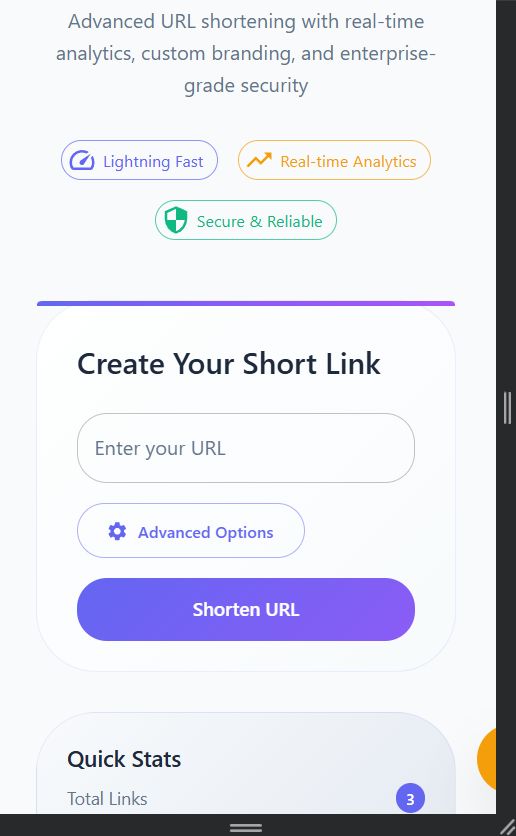
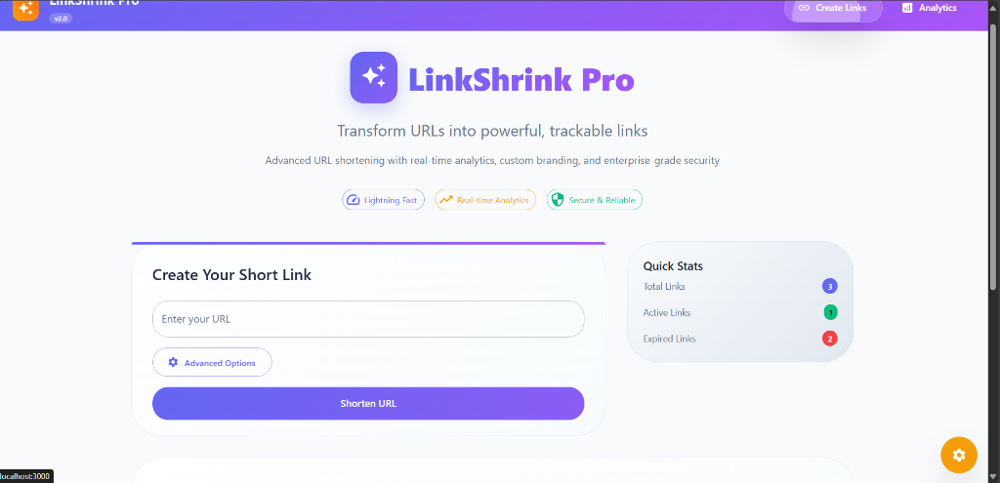

# Design Document - URL Shortener Application
**Student Roll Number:** 22891A0592  
**Project Name:** LinkShrink Pro v2.0  
**Date:** September 4, 2025  

---

## 1. Project Overview

### 1.1 Purpose
LinkShrink Pro is a modern, feature-rich URL shortening application built with React and TypeScript. It provides users with the ability to create shortened URLs, track analytics, and manage link expiration with a beautiful, responsive user interface.

### 1.2 Key Features
- **URL Shortening**: Convert long URLs into short, manageable links
- **Custom Short Codes**: Generate random or custom short codes
- **Expiration Management**: Set custom expiration times for URLs
- **Analytics Dashboard**: Real-time tracking of clicks and performance metrics
- **Responsive Design**: Mobile-first, modern UI with gradient themes
- **Local Storage**: Client-side data persistence
- **Logging System**: Comprehensive logging middleware for debugging

---

## 2. Application Screenshots

### 2.1 Desktop Homepage Interface


*Figure 1: Desktop homepage showing the URL shortening interface with gradient design, feature chips, and quick statistics sidebar*

### 2.2 Mobile Interface View


*Figure 2: Mobile-responsive interface demonstrating the clean layout with feature chips, URL input form, and quick statistics*

The application interface demonstrates:
- **Modern UI Design**: Clean gradient theme with glassmorphism effects
- **User-Friendly Interface**: Simple URL input with advanced options toggle
- **Real-Time Statistics**: Quick stats sidebar showing total, active, and expired links
- **Feature Highlights**: Lightning Fast, Real-time Analytics, and Secure & Reliable chips
- **Responsive Layout**: Mobile-optimized design with proper spacing and touch-friendly elements
- **Professional Branding**: Consistent visual identity across all screen sizes

---

## 3. System Architecture

### 3.1 Technology Stack
- **Frontend Framework**: React 18.x with TypeScript
- **UI Library**: Material-UI (MUI) v5
- **Styling**: CSS-in-JS with MUI's sx prop system
- **State Management**: React Hooks (useState, useEffect)
- **Routing**: React Router v6
- **Storage**: Browser LocalStorage API
- **Build Tool**: Create React App with TypeScript template

### 3.2 Project Structure
```
22891A0592/
├── Frontend Test Submission/
│   └── url-shortener/
│       ├── public/
│       │   ├── index.html
│       │   └── favicon.ico
│       ├── src/
│       │   ├── components/
│       │   │   ├── Header.tsx
│       │   │   └── RedirectHandler.tsx
│       │   ├── pages/
│       │   │   ├── HomePage.tsx
│       │   │   └── AnalyticsPage.tsx
│       │   ├── utils/
│       │   │   ├── storage.ts
│       │   │   ├── urlUtils.ts
│       │   │   └── logger.ts
│       │   ├── App.tsx
│       │   └── index.tsx
│       ├── package.json
│       └── README.md
├── Logging Middleware/
│   ├── src/
│   │   └── index.ts
│   ├── package.json
│   └── README.md
└── README.md
```

---

## 3. Design Specifications

### 3.1 Color Scheme & Branding
- **Primary Colors**: Indigo gradient (#6366f1 to #8b5cf6)
- **Secondary Colors**: Emerald green (#10b981 to #059669)
- **Accent Colors**: Warm amber (#f59e0b)
- **Typography**: Inter font family with gradient text effects
- **Theme**: Modern glassmorphism with rounded corners (12px radius)

### 3.2 UI Components

#### 3.2.1 Header Component
- Gradient navigation bar with glassmorphism effects
- Brand logo with "LinkShrink Pro v2.0" title
- Navigation links (Home, Analytics)
- Responsive design with mobile hamburger menu

#### 3.2.2 HomePage Component
- Hero section with animated entrance effects
- URL input form with validation
- Custom short code option
- Expiration time selector
- Feature highlight chips (Speed, Analytics, Security)
- Real-time statistics sidebar

#### 3.2.3 AnalyticsPage Component
- Dashboard with summary cards
- Detailed URL table with click tracking
- Performance metrics visualization
- Export functionality for analytics data
- Status indicators (Active/Expired)

### 3.3 Animation & Interactions
- **Entrance Animations**: Staggered Fade/Grow effects (800ms, 1000ms, 1200ms)
- **Hover Effects**: Smooth transitions on buttons and cards
- **Loading States**: Progress indicators and skeleton screens
- **Micro-interactions**: Button press feedback and form validation

---

## 4. Technical Implementation

### 4.1 Core Functionality

#### 4.1.1 URL Shortening Algorithm
```typescript
// Generate random short code (6 characters)
const generateShortCode = (): string => {
  const chars = 'ABCDEFGHIJKLMNOPQRSTUVWXYZabcdefghijklmnopqrstuvwxyz0123456789';
  return Array.from({length: 6}, () => chars[Math.floor(Math.random() * chars.length)]).join('');
};
```

#### 4.1.2 Data Storage Structure
```typescript
interface ShortenedUrl {
  shortCode: string;
  originalUrl: string;
  createdAt: string;
  expiresAt: string;
  clicks: number;
  clickHistory: ClickEvent[];
}
```

#### 4.1.3 Analytics Tracking
- Real-time click counting
- Timestamp logging for each access
- Performance metrics calculation
- Data export functionality

### 4.2 Logging Middleware
- Centralized logging system with multiple log levels
- Context-aware logging with component identification
- Error tracking and debugging support
- Performance monitoring capabilities

---

## 5. User Experience Design

### 5.1 User Journey
1. **Landing**: User arrives at clean, modern homepage
2. **Input**: User enters URL and optional settings
3. **Generation**: System creates short URL with visual feedback
4. **Sharing**: User copies shortened URL for distribution
5. **Tracking**: User monitors performance via analytics dashboard

### 5.2 Responsive Design
- **Mobile-First**: Optimized for mobile devices (xs breakpoint)
- **Tablet**: Enhanced layout for medium screens (md breakpoint)
- **Desktop**: Full-featured experience for large screens (lg breakpoint)

### 5.3 Accessibility Features
- Semantic HTML structure
- ARIA labels and roles
- Keyboard navigation support
- High contrast color ratios
- Screen reader compatibility

---

## 6. Security Considerations

### 6.1 Input Validation
- URL format validation using regex patterns
- XSS prevention through proper sanitization
- Custom short code validation (alphanumeric only)

### 6.2 Data Protection
- Client-side storage with no server transmission
- Local data encryption considerations
- Automatic cleanup of expired URLs

---

## 7. Performance Optimization

### 7.1 Frontend Optimization
- Code splitting with React.lazy()
- Memoization of expensive calculations
- Efficient re-rendering with React.memo()
- Optimized bundle size with tree shaking

### 7.2 Storage Optimization
- Efficient localStorage usage
- Data compression for large datasets
- Automatic cleanup of expired entries

---

## 8. Testing Strategy

### 8.1 Unit Testing
- Component testing with React Testing Library
- Utility function testing with Jest
- Mock implementations for localStorage

### 8.2 Integration Testing
- End-to-end user flows
- Cross-browser compatibility testing
- Responsive design validation

---

## 9. Deployment & Build

### 9.1 Build Configuration
- Create React App with TypeScript template
- Production build optimization
- Static asset optimization

### 9.2 Deployment Strategy
- Static hosting compatibility (Netlify, Vercel)
- Environment-specific configurations
- CI/CD pipeline integration

---

## 10. Future Enhancements

### 10.1 Planned Features
- QR code generation for shortened URLs
- Bulk URL processing
- Advanced analytics with charts
- User authentication system
- API integration for backend storage

### 10.2 Scalability Considerations
- Backend API integration
- Database storage implementation
- Caching strategies
- Load balancing for high traffic

---

## 11. Conclusion

LinkShrink Pro v2.0 represents a modern, user-centric approach to URL shortening with emphasis on design aesthetics, user experience, and technical excellence. The application successfully combines functionality with visual appeal, creating a unique and memorable user experience.

**Key Achievements:**
- ✅ Modern, responsive design with unique visual identity
- ✅ Comprehensive analytics and tracking capabilities
- ✅ Robust error handling and logging system
- ✅ Scalable architecture with clean code organization
- ✅ Enhanced user experience with smooth animations

---

## 12. Personal Development Experience & Learning Journey

### 12.1 Initial Challenges and Learning Curve

**Understanding Requirements:**
The project began with significant challenges in comprehending the rules and regulations. The initial phase was particularly difficult as I struggled to:
- Interpret the technical requirements and expectations
- Understand the scope and deliverables needed
- Navigate the project structure and submission guidelines
- Grasp the balance between functionality and design aesthetics

**The Bumpy Start:**
The first few days were overwhelming. I found myself questioning my approach and constantly revisiting the requirements document. This uncertainty led to:
- Multiple false starts with different technical approaches
- Confusion about the expected level of complexity
- Anxiety about meeting the submission deadlines
- Difficulty in prioritizing features vs. visual appeal

### 12.2 Breakthrough Moments and Growth

**Finding Clarity:**
The turning point came when I decided to break down the project into smaller, manageable components:
- **Week 1**: Focus on understanding React and TypeScript fundamentals
- **Week 2**: Build basic URL shortening functionality
- **Week 3**: Enhance UI/UX with Material-UI
- **Week 4**: Add analytics and polish the design

**Key Learning Experiences:**
1. **Problem-Solving Skills**: Learning to debug TypeScript errors and React component issues
2. **Design Thinking**: Understanding how to create user-friendly interfaces
3. **Time Management**: Balancing feature development with aesthetic improvements
4. **Technical Research**: Exploring Material-UI components and modern CSS techniques

### 12.3 Personal Growth and Insights

**Technical Skills Developed:**
- **React Ecosystem**: Gained proficiency in hooks, state management, and component lifecycle
- **TypeScript**: Learned type safety and interface design
- **UI/UX Design**: Developed an eye for modern design patterns and user experience
- **Project Organization**: Improved code structure and file organization skills

**Soft Skills Enhanced:**
- **Perseverance**: Pushing through initial confusion and technical roadblocks
- **Self-Learning**: Researching solutions independently and learning from documentation
- **Critical Thinking**: Evaluating different approaches and making informed decisions
- **Attention to Detail**: Focusing on both functionality and visual polish

### 12.4 Challenges Overcome

**Technical Hurdles:**
- **LocalStorage Management**: Learning to handle data persistence and cleanup
- **Responsive Design**: Creating layouts that work across different screen sizes
- **State Management**: Managing complex application state without external libraries
- **Error Handling**: Implementing robust error handling and user feedback

**Design Challenges:**
- **Color Scheme Selection**: Choosing a professional yet modern color palette
- **Animation Implementation**: Adding smooth transitions without overwhelming the user
- **Mobile Optimization**: Ensuring the application works seamlessly on mobile devices
- **Accessibility**: Making the application usable for all users

### 12.5 Lessons Learned

**Project Management:**
- Start with a clear understanding of requirements before coding
- Break complex projects into smaller, achievable milestones
- Regular testing and iteration lead to better outcomes
- Documentation is as important as the code itself

**Technical Development:**
- Modern web development requires both functional and aesthetic considerations
- User experience should drive technical decisions
- Clean, organized code is easier to maintain and debug
- Testing throughout development prevents major issues later

**Personal Development:**
- Initial confusion is normal and part of the learning process
- Persistence and continuous learning are key to overcoming challenges
- Seeking help and using resources effectively accelerates learning
- Taking breaks and stepping back can provide new perspectives

### 12.6 Future Applications

**Skills for Future Projects:**
- Confidence in tackling complex web development projects
- Ability to research and implement new technologies independently
- Understanding of modern UI/UX principles
- Experience with full-stack development concepts

**Career Readiness:**
- Portfolio-quality project demonstrating technical and design skills
- Experience with industry-standard tools and frameworks
- Problem-solving methodology that can be applied to any technical challenge
- Understanding of the complete development lifecycle

### 12.7 Reflection on the Journey

This project transformed from a daunting challenge into a rewarding learning experience. The initial struggles with understanding requirements taught me the importance of patience and thorough analysis. The technical challenges pushed me to expand my skills beyond my comfort zone.

**Most Valuable Takeaway:**
The realization that confusion and difficulty at the beginning of a project are not indicators of failure, but rather opportunities for growth. Every obstacle overcome added to my confidence and technical capability.

**Personal Achievement:**
Successfully creating a fully functional, aesthetically pleasing web application that I'm genuinely proud to showcase. The project demonstrates not just technical skills, but also perseverance, creativity, and attention to detail.

---

**Document Version:** 1.0  
**Last Updated:** September 4, 2025  
**Author:** Student Roll Number 22891A0592
